# exam_app

A new Flutter project.

## Screenshots

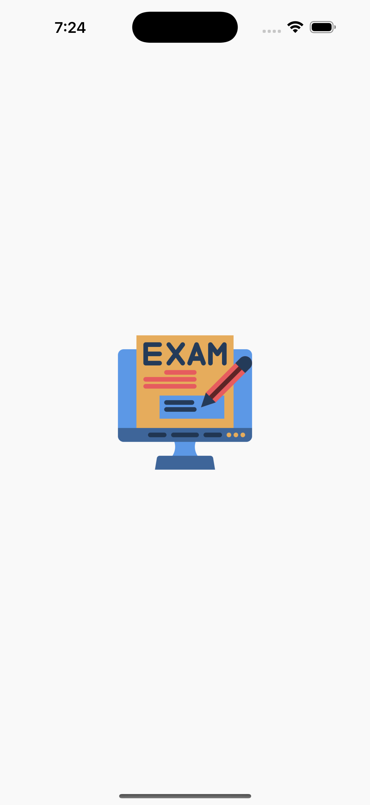
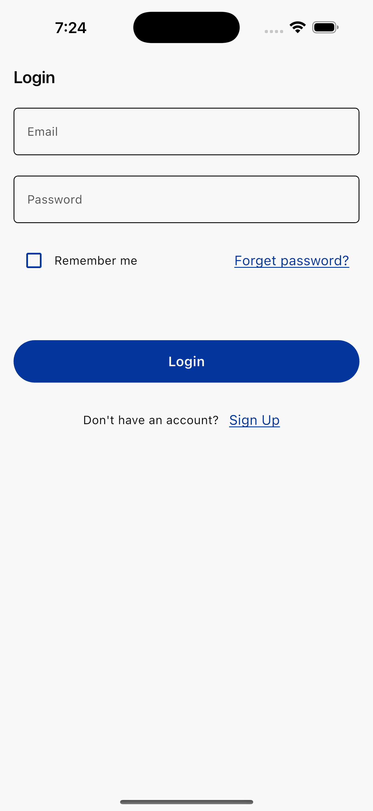
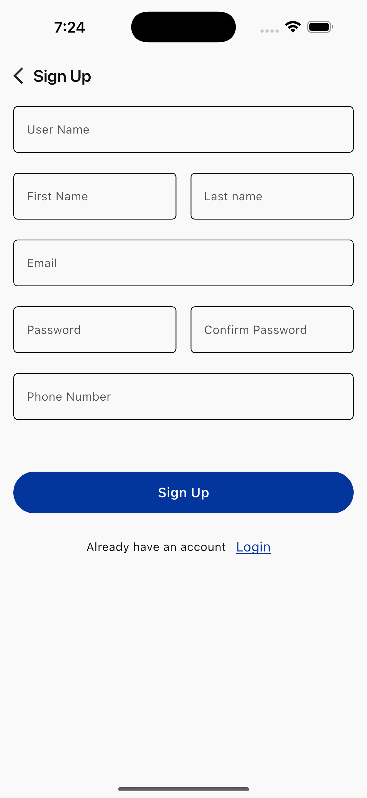
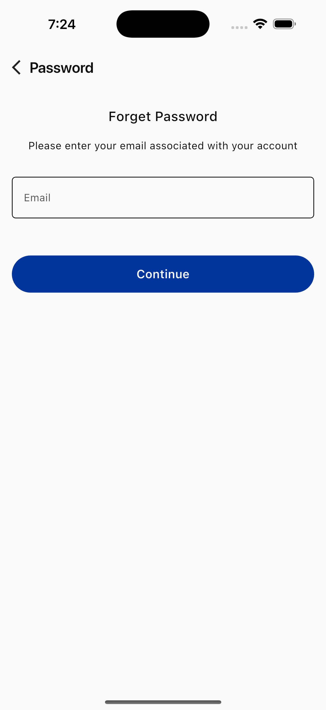
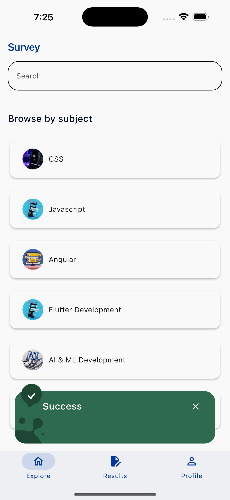
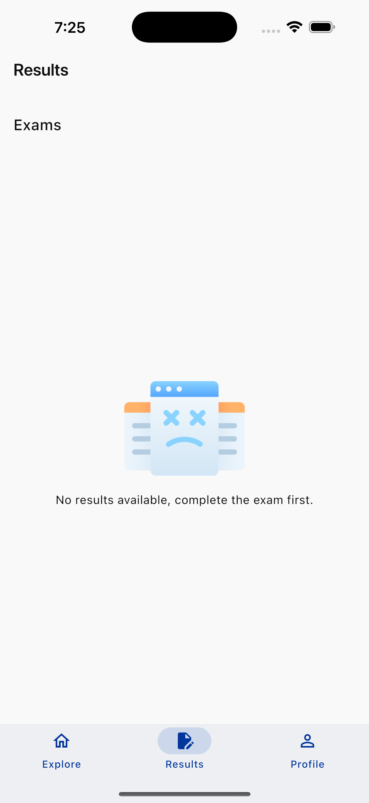
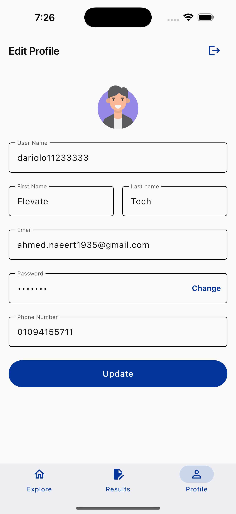
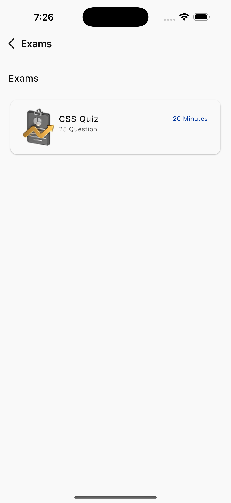
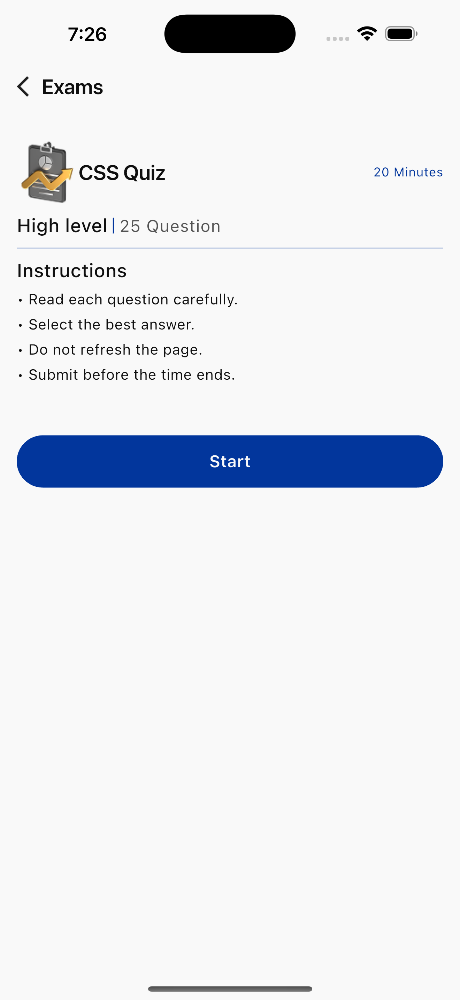
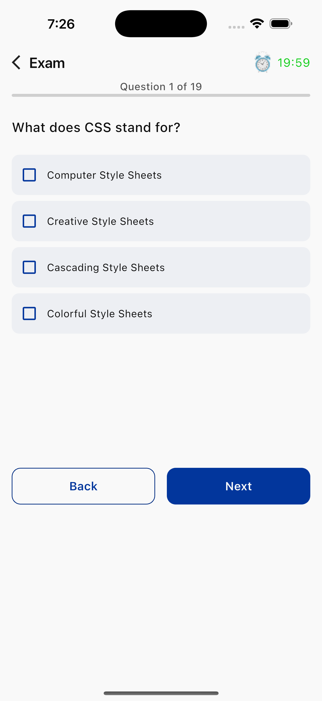
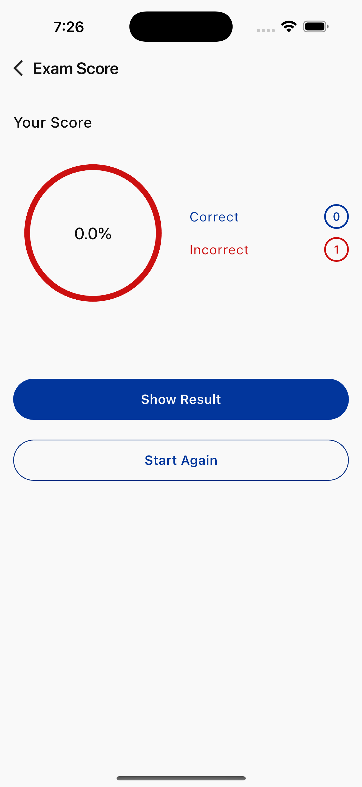
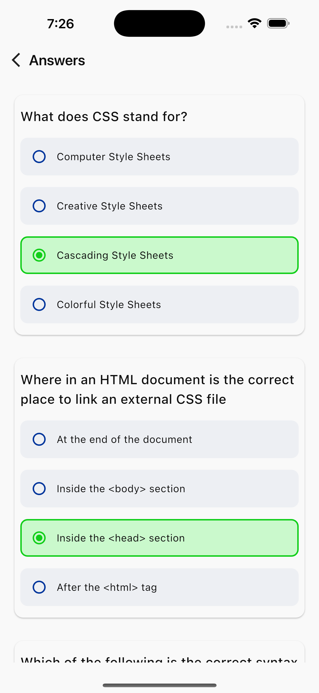

## App Structure

The `lib` directory contains the main source code for the application, organized into `core` and `features` modules.

```
lib/
├── core/
│   ├── base_state/
│   ├── config/
│   ├── constant/
│   ├── custom_widgets_model/
│   ├── error/
│   ├── helper_function/
│   ├── local_data/
│   ├── module/
│   ├── route/
│   ├── theme/
│   ├── use_case/
│   └── widgets/
├── features/
│   ├── auth/
│   │   ├── forget_password/
│   │   ├── signin/
│   │   └── signup/
│   ├── home/
│   │   ├── presentation/
│   │   └── sections/
│   └── splash/
│       ├── data/
│       ├── domain/
│       ├── external/
│       └── presentation/
└── main.dart
```

### Core Module (`lib/core`)
This module contains foundational components and utilities used across the application:
- `base_state/`: Base classes for state management.
- `config/`: Configuration files, including dependency injection setup (`di.dart`).
- `constant/`: Application-wide constants such as API endpoints, assets paths, and text strings.
- `custom_widgets_model/`: Models for custom widgets.
- `error/`: Error handling classes, like `failure.dart`.
- `helper_function/`: Utility functions, e.g., `format_time.dart` and `validation.dart`.
- `local_data/`: Local data storage solutions, including `hive/` and `secure_storage/`.
- `module/`: Modules for third-party integrations or specific functionalities, like `dio_module.dart` for HTTP requests.
- `route/`: Routing definitions and generation logic.
- `theme/`: Application theming, including color palettes (`app_colors.dart`) and theme data (`app_theme.dart`).
- `use_case/`: Abstract use case definitions.
- `widgets/`: Reusable custom widgets.

### Features Module (`lib/features`)
This module organizes the application's functionality into distinct features:
- `auth/`: Handles user authentication, including sub-modules for `forget_password`, `signin`, and `signup`.
- `home/`: Contains components related to the main home screen, separated into `presentation/` and `sections/`.
- `splash/`: Manages the splash screen, with layers for `data/`, `domain/`, `external/`, and `presentation/`.

### `main.dart`
The entry point of the Flutter application, responsible for initializing the app and setting up the widget tree.